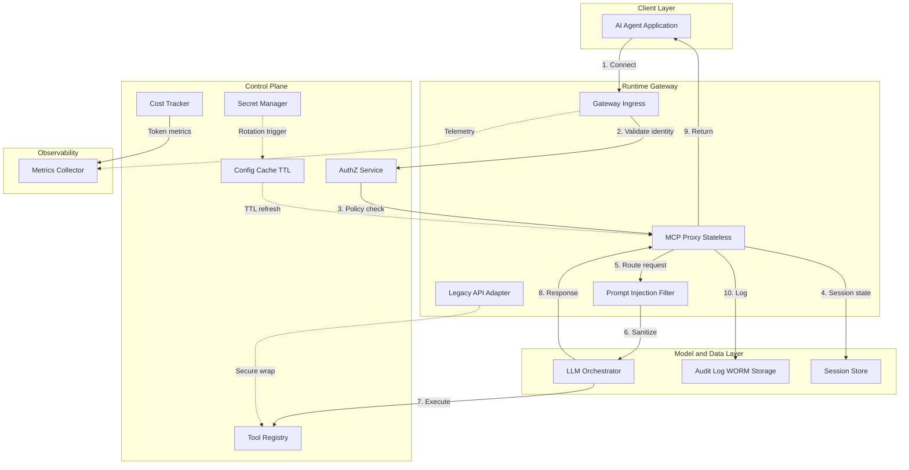

# Secure MCP Gateway

A zero-trust gateway for Model Context Protocol (MCP) tool access in enterprise AI environments.

Agents never talk to tools directly. Every request passes through ingress authentication, centralized authorization, session tracking, and an append-only audit trail before a tool is invoked.

## Architecture



### What this repo implements today (Phase 1)

| Component | Role in this MVP |
| --- | --- |
| Gateway Ingress | `POST /mcp/connect` entrypoint |
| AuthZ Service | Allow/deny policies per agent + tool |
| Session Store | In-memory session affinity |
| Audit Log | Append-only WORM-style event log |
| Health endpoint | `GET /health` |

Phase 2+ items in the diagram (prompt filter, secret manager, cost tracker, legacy adapter) are intentionally out of scope for this MVP.

## Requirements

- Python 3.11+
- `pip`

## Setup

```bash
git clone https://github.com/AIFrontiersLab/secure-mcp-gateway.git
cd secure-mcp-gateway

python -m venv .venv
source .venv/bin/activate   # Windows: .venv\Scripts\activate
pip install -r requirements.txt
```

## Run the API

```bash
uvicorn main:app --host 0.0.0.0 --port 8000
```

Open interactive docs at `http://127.0.0.1:8000/docs`.

## Run the local demo

Without starting a long-lived server:

```bash
python -c "from main import demo; demo()"
```

Expected flow:

1. `agent-alpha` is allowed to call `data-lookup`
2. `agent-beta` is denied
3. Both decisions appear in the audit log

## API reference

### `GET /health`

```bash
curl -s http://127.0.0.1:8000/health
```

### `POST /mcp/connect`

```bash
curl -s http://127.0.0.1:8000/mcp/connect \
  -H 'content-type: application/json' \
  -d '{
    "agent_id": "agent-alpha",
    "tool_name": "data-lookup",
    "payload": {"query": "vpn runbook"}
  }'
```

Request body:

| Field | Type | Description |
| --- | --- | --- |
| `agent_id` | string | Calling agent identity |
| `tool_name` | string | Tool the agent wants to invoke |
| `payload` | object | Tool input |

Successful response includes `request_id`, `session_id`, and `audit_id`.

Denied requests return HTTP `403`.

### `GET /audit/logs`

```bash
curl -s http://127.0.0.1:8000/audit/logs
```

Returns the append-only audit trail for allow/deny decisions.

## Built-in demo policies

| Agent | Tool | Result |
| --- | --- | --- |
| `agent-alpha` | `data-lookup` | allow |
| `agent-alpha` | `write-data` | allow |
| `agent-beta` | `data-lookup` | deny |
| anything else | anything else | deny (default) |

## Tests

```bash
pytest -q
```

## Project layout

```text
.
├── README.md
├── main.py              # Gateway, AuthZ, sessions, audit log, demo
├── requirements.txt
├── .gitignore
└── tests/
    └── test_main.py
```

## Design notes

- Proxies stay stateless; session affinity lives in the session store.
- Authorization is evaluated before any tool work begins.
- Audit events are append-only so decisions remain reviewable later.
- Production deployments should replace the in-memory stores with Redis (or equivalent) and WORM object storage, and terminate real mTLS at ingress.
